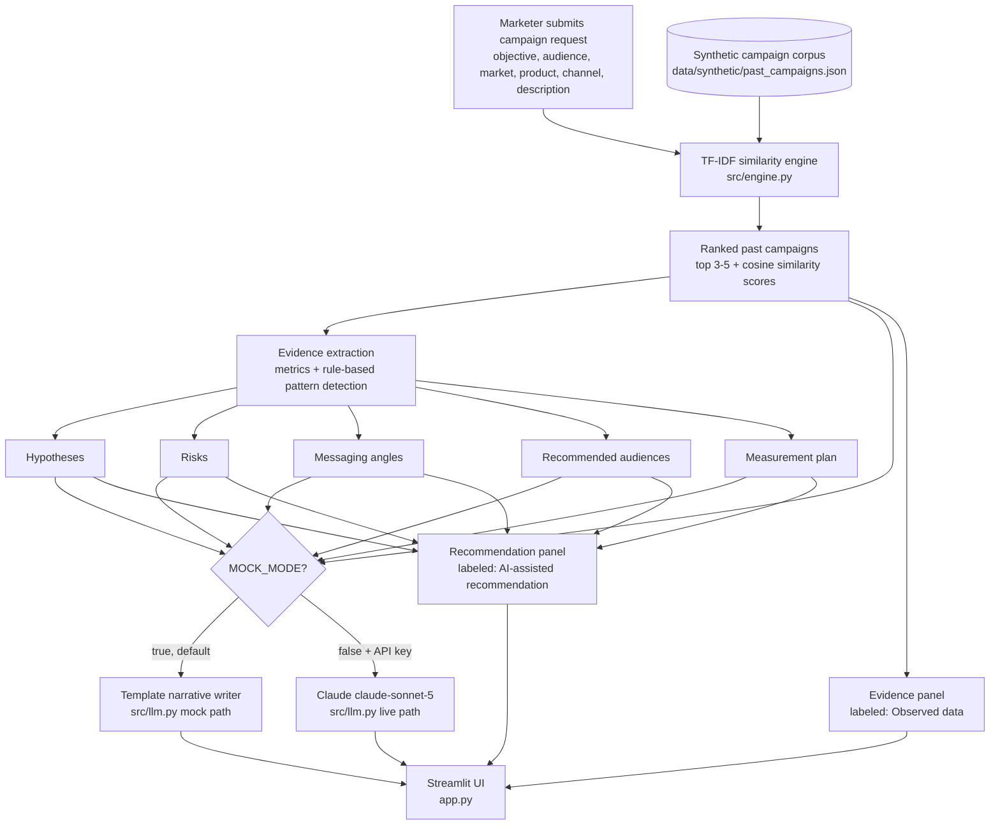

# Campaign Intelligence Agent

**Turns a five-minute campaign brief conversation into an evidence-backed brief in seconds, by grounding every recommendation in real historical campaign performance instead of generic best practices.**

## What this demonstrates

- Retrieval-and-reasoning pattern: real TF-IDF similarity search over a structured corpus, not a black-box LLM guess, decides which historical evidence applies.
- Deterministic, auditable rule derivation: hypotheses, risks, and messaging angles are computed from the matched campaigns' actual metrics via named, testable rules -- every claim traces back to data.
- Responsible-AI UX discipline: the interface never blends "what we observed" with "what the AI recommends" -- they are two clearly labeled panels, plus a coverage indicator that flags when evidence is too thin to trust.

## Demo moment

A marketer fills in: objective = **lead generation**, audience = **IT directors at mid-market manufacturers**, market = **North America**, product = **CloudSync Ops Platform**, channel = **LinkedIn**, with a short description of the campaign concept.

The agent returns:

- **Evidence:** the past campaign `CMP-001` as a ~0.9+ similarity top match (observed CTR 2.1%, conversion rate 3.4%, cost per lead $88.50), plus 2-4 other related matches.
- **Recommendation:** hypotheses like "expect a CTR around 2.1% and conversion rate around 3.4%, based on 1+ similar past campaigns," a candidate messaging angle ("ROI / cost calculator as the lead magnet -- seen in 2 matched campaigns"), recommended audiences, risks (e.g. budget or creative-fatigue flags where the data supports them), and a measurement plan -- all clearly marked "AI-assisted recommendation, review before use."

## Architecture



See [`docs/architecture.md`](docs/architecture.md) for the component-level description.

## Quickstart

```bash
pip install -r requirements.txt
streamlit run app.py
```

Runs entirely in **mock mode by default** (`MOCK_MODE=true`) -- zero API keys required. The similarity matching, metrics, hypotheses, risks, and measurement plan are all real, deterministic logic; only the final narrative paragraph is template-written instead of Claude-written.

## Switching to live mode

```bash
cp .env.example .env
```

Then set in `.env`:

```
MOCK_MODE=false
ANTHROPIC_API_KEY=sk-ant-...
```

In live mode, `src/llm.py` sends the already-matched campaigns and already-derived hypotheses/risks to Claude (`claude-sonnet-5`) to write a more polished narrative paragraph. Claude never chooses which campaigns matched or changes the underlying metrics -- that stays with the deterministic engine in both modes.

## Human review, escalation & exceptions

This agent produces a *draft* brief, not a final campaign plan. The explicit human-in-the-loop point is the **Recommendation panel itself**: every hypothesis, risk, messaging angle, and audience suggestion is labeled "AI-assisted recommendation, review before use" and a marketer/strategist must sign off before any budget, creative, or targeting decision is made from it. When the **coverage indicator** flags thin evidence (fewer than 2 matches above the similarity threshold), the recommendation should be treated as a hypothesis to test in a small pilot, not a benchmark to plan a full budget against.

## Evaluation

"Correct" for this agent means:

- The top-ranked match for a request that closely resembles a past campaign is that same past campaign, with a high similarity score.
- A request unlike anything in the corpus produces low similarity scores across all candidates and trips the "thin evidence" flag.
- Hypotheses and risks are non-empty whenever there is a reasonable evidence base, and are traceable to the matched campaigns' real metrics (no invented numbers).

Run the test suite:

```bash
pytest
```

## Roadmap

- **Prototype** (this repo): synthetic 15-campaign corpus, TF-IDF matching, rule-based hypotheses/risks, Streamlit demo.
- **Pilot**: connect to the real campaign performance warehouse, expand the corpus to hundreds of real (anonymized) campaigns, and validate the rule thresholds (similarity cutoff, CTR/cost baselines) against actual outcomes with the marketing team.
- **Production controls**: audit log of every generated brief and the evidence it cited, versioned rule thresholds, role-based access so only approved brief authors can publish externally, and a required reviewer sign-off step before a brief leaves draft status.
- **Rollout & adoption measurement**: track brief-to-campaign conversion rate, time saved per brief vs. the prior manual process, and how often marketers override or reject the AI recommendation -- a high override rate signals the rules or corpus need retuning.

## Disclaimer

All campaign records, company names, and metrics in this repository are synthetic and fictional, generated for demonstration purposes only. This tool does not provide legal, financial, or regulatory advice, and its output should not be treated as a substitute for professional marketing judgment or as a guarantee of real-world campaign performance.

## License

MIT -- see [LICENSE](LICENSE).
