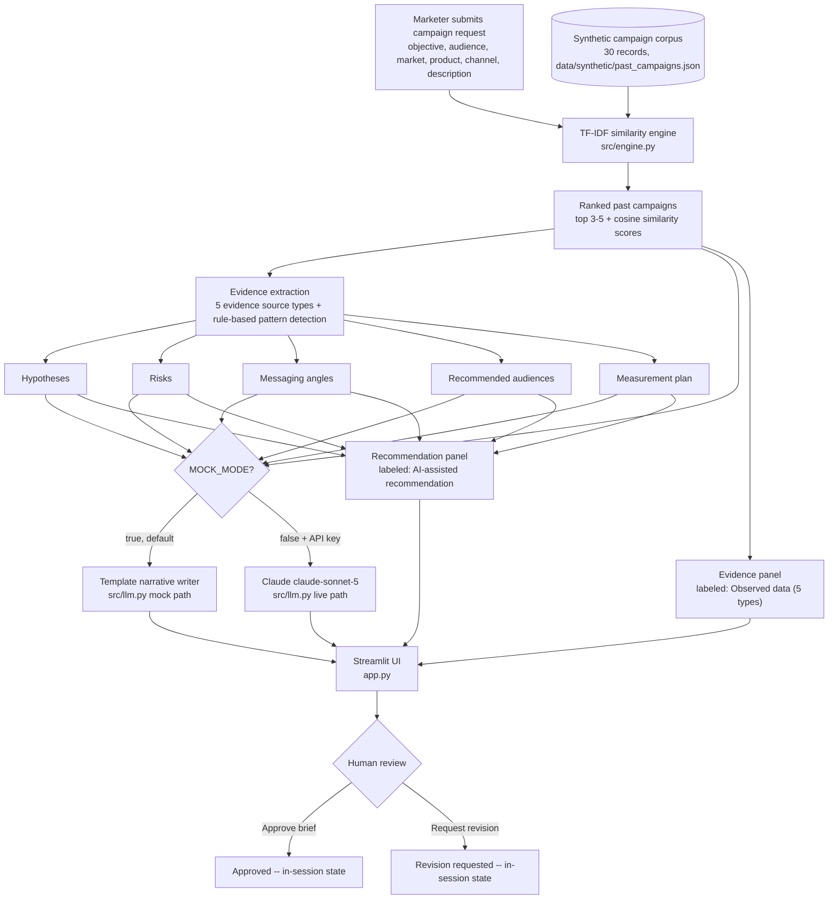

# Campaign Intelligence Agent

**Maturity:** Streamlit Cloud deployment pending · Synthetic data · Evidence-backed briefing

**Turns a five-minute campaign brief conversation into an evidence-backed brief in seconds, by grounding every recommendation in real historical campaign performance instead of generic best practices.**

## 1. Business problem

Marketers write new campaign briefs from memory and gut feel because pulling together comparable past campaigns, personas, market context, creative precedent, and performance benchmarks by hand takes too long to do for every brief.

## 2. What the agent does

A marketer enters a campaign goal, audience, market, and channel; the agent retrieves the most similar synthetic past campaigns and, from their real recorded evidence, produces a structured, evidence-backed campaign brief -- hypotheses, messaging angles, recommended audiences, risks, and a measurement plan -- for a human reviewer to approve or send back for revision.

## 3. What this demo is

- A deterministic TF-IDF similarity-matching and rule-based evidence-derivation pipeline over a 30-record synthetic campaign corpus, runnable entirely locally.
- An engine that explicitly models **5 evidence source types** per matched campaign -- prior campaign brief, persona research, customer/market insight, creative asset reference, and performance benchmark -- each rendered in its own labeled block in the Evidence panel.
- A working demonstration of a UI that keeps "observed evidence" and "AI-assisted recommendation" in clearly separate, clearly labeled panels, with an explicit human-review checkpoint (Approve / Request revision) before a brief would be acted on.
- Fully functional in mock mode with zero API keys or external services required.

## 4. What this demo is not

- **No real authentication or authorization.** There is no login, no user accounts, and no access control of any kind -- anyone who runs the app sees and can use everything.
- **No live integration beyond the optional Claude narration call.** With `MOCK_MODE=false` and a valid `ANTHROPIC_API_KEY`, `src/llm.py` calls Claude to polish already-fixed evidence into prose. Every other part of the pipeline (matching, metrics, hypotheses, risks) is local deterministic logic -- there is no live campaign-performance data warehouse, CRM, or ad-platform connection.
- **No hosted deployment yet.** See Deployment instructions below -- this pass prepares the repo for Streamlit Community Cloud but does not perform the deployment.
- **Synthetic data only.** The entire 30-campaign corpus in `data/synthetic/past_campaigns.json` -- company names, personas, market insights, creative references, and every metric -- is fictional, generated for this demo. It is not real historical campaign performance data.
- **Not a predictive/ML model.** Campaign matching is TF-IDF cosine similarity over text fields (a classic information-retrieval technique), not a trained forecasting or machine-learning model.
- **The Approve / Request revision decision is not persisted.** It is in-session UI state only, to make the human-review checkpoint visible -- not a workflow or audit-log system.

## 5. Key workflow

1. Marketer fills in objective, audience, market, product, channel, and an optional description, then clicks **Generate brief**.
2. `src/engine.py` ranks the 30-record synthetic corpus by TF-IDF cosine similarity and returns the top matches.
3. The engine derives hypotheses, risks, messaging angles, recommended audiences, and a measurement plan from the matched campaigns' real metrics and evidence -- all rule-based and traceable, no LLM involved.
4. The UI shows a coverage indicator (flags "thin evidence" when fewer than 2 matches clear the similarity threshold), an **Evidence** panel (all 5 evidence source types per match) and a separate **Recommendation** panel (AI-assisted, labeled for review).
5. `src/llm.py` turns the fixed evidence into a narrative paragraph (template in mock mode, Claude in live mode).
6. The human reviewer clicks **Approve brief** or **Request revision** -- the explicit human-in-the-loop checkpoint.
7. **Reset state** clears the form and any generated brief.

See [`docs/workflow.md`](docs/workflow.md) for the full step-by-step flow including every UI state.

## 6. Demo metrics and how each is calculated

The in-app 3-metric panel and this table show the same numbers, computed the same way:

| Metric | Value | Exact calculation |
|---|---|---|
| Synthetic campaigns | **30** | `len(load_past_campaigns())` in `src/engine.py`, reading `data/synthetic/past_campaigns.json` -- a literal count of seeded records. |
| Evidence source types | **5** | `len(EVIDENCE_SOURCE_TYPES)` in `src/engine.py` -- a literal count of the implemented, named evidence categories (prior campaign brief, persona research, customer/market insight, creative asset reference, performance benchmark), each backed by a real field on every seeded record. |
| Automated tests | **31** | Exact output of `pytest -v` against `tests/test_engine.py` at release time -- 31 passed, 0 failed. See `docs/evaluation-plan.md` for what each test group verifies. |

Deck-metric line: **30 synthetic campaigns · 5 evidence sources · 31 retrieval/brief-quality tests**

## 7. Architecture overview



See [`docs/architecture.md`](docs/architecture.md) for the component-level description and [`docs/data-model.md`](docs/data-model.md) for the exact data shapes.

## 8. Integration matrix

| Integration | Status | Notes |
|---|---|---|
| LLM narration (Claude) | `mock` (default) / `live` (optional) | `MOCK_MODE=true` (default): template-written narrative, no network call, no key required. `MOCK_MODE=false` + valid `ANTHROPIC_API_KEY`: calls `claude-sonnet-5` via `src/llm.py` to polish the already-fixed, already-derived evidence into prose. Claude never chooses matches or invents metrics in either mode. This is the only integration point with a live option. |
| Campaign performance corpus | `mock` | Static synthetic JSON file (`data/synthetic/past_campaigns.json`), 30 fictional campaigns. No live data warehouse or CRM connection exists or is planned for this prototype stage. |
| Authentication | `mock` (stub) | No login, accounts, or access control -- the app is a single unauthenticated view. |
| Human-review persistence | `planned` | Approve / Request revision is in-session UI state only in this release; a persisted, audited review record is planned for the pilot/production stages (see `docs/production-path.md`). |

## 9. Local setup

```bash
pip install -r requirements.txt
streamlit run app.py
```

Runs entirely in **mock mode by default** (`MOCK_MODE=true`) -- zero API keys required. The similarity matching, metrics, hypotheses, risks, and measurement plan are all real, deterministic logic; only the final narrative paragraph is template-written instead of Claude-written.

## 10. Environment variables

Copy `.env.example` to `.env` to configure:

| Variable | Default | Purpose |
|---|---|---|
| `MOCK_MODE` | `true` | When `true`, the app runs entirely on deterministic logic -- no network calls, no API key required. Set to `false` to enable live Claude narration. |
| `ANTHROPIC_API_KEY` | *(empty)* | Required only when `MOCK_MODE=false`. Get a key at https://console.anthropic.com/ |

## 11. Deployment instructions

Target platform: **Streamlit Community Cloud** (share.streamlit.io).

- Repo: this repository.
- Branch: `main`.
- Main file: `app.py`.
- **No secrets required for the default mock-mode deploy.**
- For live mode, add `ANTHROPIC_API_KEY` and `MOCK_MODE=false` in Streamlit Cloud's **Secrets** panel for the app (Settings -> Secrets), in `.toml` format:
  ```toml
  MOCK_MODE = "false"
  ANTHROPIC_API_KEY = "sk-ant-..."
  ```

This repository has not been deployed as part of this release pass -- see the Maturity line at the top of this README.

## 12. Test and evaluation approach

Run the test suite:

```bash
pytest -v
```

**Exact verified count: 31/31 tests passed.** See [`docs/evaluation-plan.md`](docs/evaluation-plan.md) for what each test (or test group) checks and why it counts as evidence of correctness -- covering corpus/schema integrity, matching quality across the full 30-campaign corpus (including every newly added objective/market/channel/product line), thin-evidence detection, hypothesis/risk derivation rules, messaging-angle and audience derivation, measurement-plan branching, brief-quality structural checks, and mock-narrative content checks.

## 13. Accessibility and privacy notes

- Built entirely from native Streamlit widgets (`st.selectbox`, `st.text_input`, `st.text_area`, `st.button`, `st.expander`, `st.metric`), which are keyboard-operable and screen-reader-labeled by Streamlit's own accessibility support.
- Streamlit gives limited control over custom focus order or ARIA attributes beyond what native widgets provide -- this app does not attempt to override Streamlit's default focus/tab order.
- Color is not the only signal for the coverage indicator: the warning/success banners are also accompanied by explicit text ("Thin evidence: ...", the strong/total match counts) and an emoji glyph, not color alone.
- No PII is collected. The form accepts free-text audience/product/description fields, but nothing is transmitted, stored, or logged beyond the current browser session's in-memory state -- see `docs/limitations.md`.

## 14. Known limitations

See [`docs/limitations.md`](docs/limitations.md) for the full list -- these are intentional prototype scope boundaries, not defects. No defects were found in `src/engine.py`'s matching or evidence-derivation logic during the independent build+audit pass or this release pass.

## 15. Production-readiness roadmap

See [`docs/production-path.md`](docs/production-path.md) for the full staged plan (Pilot -> Production controls -> Rollout & adoption measurement) expanding on the summary below.

- **Prototype** (this repo): synthetic 30-campaign corpus, TF-IDF matching, rule-based hypotheses/risks, all 5 evidence source types, Streamlit demo with an explicit human-review checkpoint.
- **Pilot**: connect to the real campaign performance warehouse, expand the corpus to hundreds of real (anonymized) campaigns, and validate the rule thresholds against actual outcomes with the marketing team.
- **Production controls**: audit log of every generated brief and the evidence it cited (including the reviewer's Approve/Request-revision decision), versioned rule thresholds, role-based access, and a required reviewer sign-off step before a brief leaves draft status.
- **Rollout & adoption measurement**: track brief-to-campaign conversion rate, time saved per brief vs. the prior manual process, and the reviewer revision-request rate -- a high rate signals the rules or corpus need retuning.

## 16. Screenshot

Screenshot pending first Streamlit Cloud deploy. *(NOT VERIFIED -- no deployment or screenshot was produced by this release pass; do not treat this section as showing a live app.)*

## Human review, escalation & exceptions

This agent produces a *draft* brief, not a final campaign plan. The explicit human-in-the-loop point is now a UI control, not just a label: after a brief is generated, the reviewer clicks **Approve brief** or **Request revision** in the Human review section. When the **coverage indicator** flags thin evidence (fewer than 2 matches above the similarity threshold), the recommendation should be treated as a hypothesis to test in a small pilot, not a benchmark to plan a full budget against.

## Disclaimer

All campaign records, company names, personas, market insights, creative references, and metrics in this repository are synthetic and fictional, generated for demonstration purposes only. This tool does not provide legal, financial, or regulatory advice, and its output should not be treated as a substitute for professional marketing judgment or as a guarantee of real-world campaign performance.

## License

MIT -- see [LICENSE](LICENSE).
