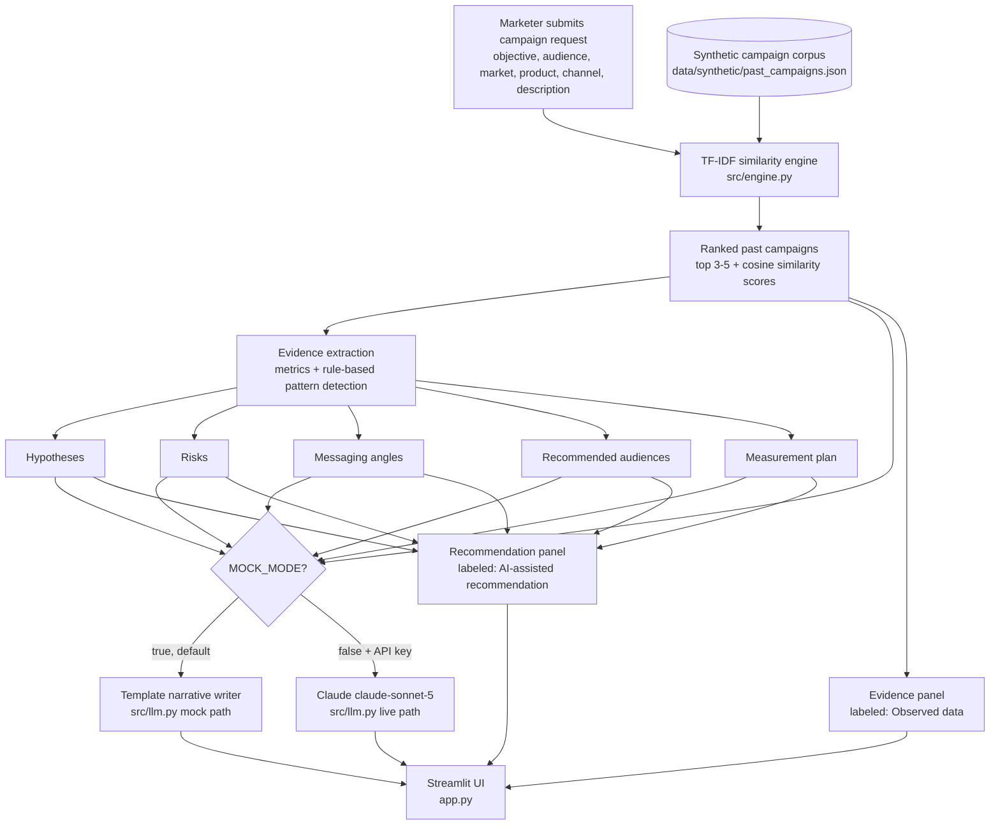

# Architecture

The Campaign Intelligence Agent turns a new campaign request into an
evidence-backed brief by first retrieving similar historical campaigns with a
deterministic similarity engine, then deriving hypotheses and risks from
their real metrics, and only optionally handing the fixed evidence to Claude
to polish into prose.

## Components

- **`src/models.py`** -- `CampaignRequest` (the form inputs), `MatchedCampaign`
  (one matched campaign carrying all 5 evidence source types -- see below),
  and `CampaignBrief` (the full output: matched campaigns, hypotheses,
  messaging angles, recommended audiences, risks, measurement plan, and
  coverage bookkeeping).
- **`src/engine.py`** -- the deterministic core. Builds a text
  representation of every past campaign and the new request, ranks past
  campaigns with `TfidfVectorizer` + `cosine_similarity` (scikit-learn, no
  LLM involved), and derives hypotheses/risks/messaging angles/recommended
  audiences/measurement plan from simple, auditable rules applied to the
  matched campaigns' real metrics. `EVIDENCE_SOURCE_TYPES` is the source of
  truth for the 5 evidence source types this engine models: prior campaign
  brief, persona research, customer/market insight, creative asset
  reference, and performance benchmark (see `docs/data-model.md`).
- **`src/llm.py`** -- takes the engine's fixed output (which campaigns
  matched, their metrics, the derived hypotheses/risks) and turns it into a
  narrative. In mock mode (default) this is a deterministic template -- no
  network call. In live mode it calls Claude (`claude-sonnet-5`) to write
  polished prose from the same fixed evidence; it cannot change which
  campaigns matched or invent new metrics.
- **`app.py`** -- Streamlit UI. Renders an **Evidence** panel (one expander
  per matched campaign with all 5 evidence source types labeled and
  displayed separately -- "Observed data") and a separate **Recommendation**
  panel (hypotheses, messaging angles, recommended audiences, risks,
  measurement plan -- labeled "AI-assisted recommendation, review before
  use"), a coverage indicator that flags when fewer than 2 matches clear the
  similarity threshold ("thin evidence"), a 3-metric transparency panel (30
  campaigns / 5 evidence types / verified test count), an explicit **human
  review checkpoint** (Approve brief / Request revision, in-session state
  only), and a **Reset state** control that clears the form and any
  generated brief.
